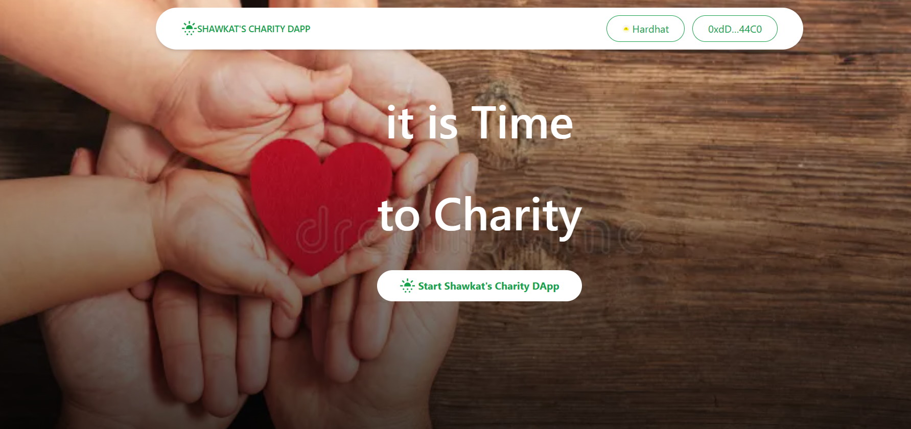
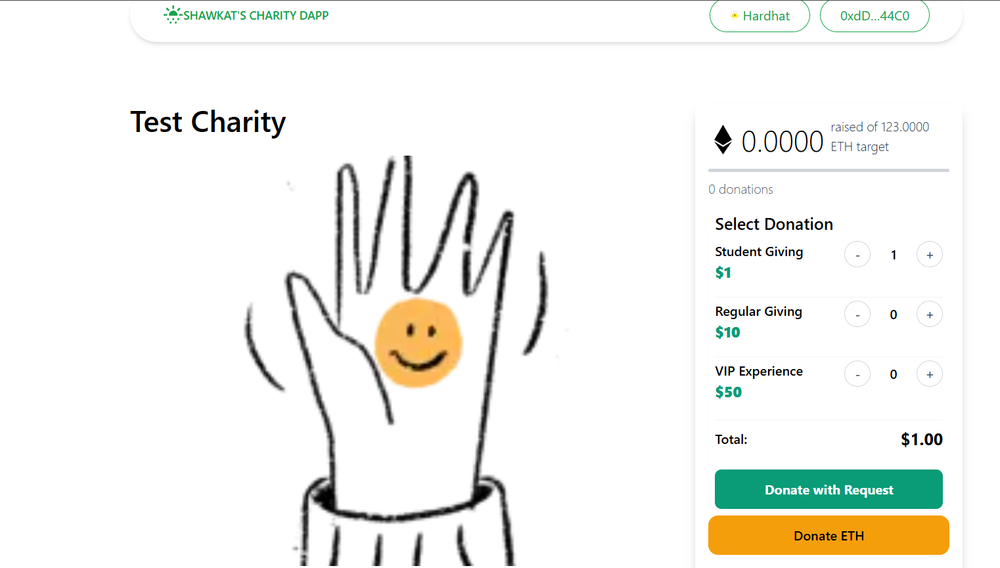

# LetsFund: Web3 Donation / Charity DApp on Sepolia Testnet with Request

A platform that enables non-profits to receive donations in various cryptocurrencies via Request Network. It offers transparency in fund management and simplifies the donation process for supporters, encouraging more contributions to charitable causes.

## Introduction 
"letsfund" is a groundbreaking Web3 charity fundraising platform designed to revolutionize the way charitable organizations raise funds and engage with their communities. Deployed on the Sepolia Blockchain, letsfund combines the transparency and security of blockchain technology with an intuitive user experience, allowing both donors and beneficiaries to experience a seamless and trustworthy process. By leveraging decentralized technologies, letsfund aims to minimize overhead costs, enhance donor engagement, and ensure that contributions have a direct and measurable impact.



Letsfund operates as a decentralized crowdfunding platform dedicated to charitable causes. Whether it's supporting humanitarian projects, funding healthcare initiatives, providing educational resources, or aiding disaster relief efforts, letsfund empowers organizations and individuals to raise funds effectively. The platform assures donors that their contributions are transparent and utilized appropriately, addressing the common concerns regarding the effectiveness of charitable donations.

The `LetsFund.sol` project is a Solidity smart contract that serves as the backbone of a decentralized application (dApp) for charity purposes. It leverages the OpenZeppelin library to ensure secure and standardized development of the contract.


The contract is designed around two primary structures: CharityStruct and SupportStruct, representing a charity and a supporter, respectively.

## Coursework Change Log (March 2026)

This section documents the modifications made on top of the original app for coursework submission.

### 1) Branding + Homepage Customization

Updated public-facing dApp name and homepage visuals:

- `components/Banner.tsx`
	- Banner image changed to local asset: `/background.webp`
	- CTA label changed to: `Start Shawkat's Charity DApp`
- `components/Header.tsx`
	- Brand text changed from `LetsFund` to `Shawkat's Charity DApp`
- `components/Footer.tsx`
	- Brand references updated to `Shawkat's Charity DApp`
- `components/Quote.tsx`
	- CTA text updated to `Start Shawkat's Charity DApp`
- `pages/index.tsx`
	- Page title updated to `Shawkat's Charity DApp`
- `services/provider.tsx`
	- RainbowKit app name updated to `Shawkat's Charity DApp`

Added/used homepage image file:

- `public/background.webp` (copied from `screenshots/background.webp`)

### 2) Wallet/Network Configuration Fixes

To fix recurring wrong-network and RPC issues:

- `services/provider.tsx`
	- Normalized supported chains to: `sepolia`, `hardhat`, `localhost`
	- Set `initialChain={sepolia}`
	- Added safer provider fallback logic when optional API keys are missing

### 3) Local Hardhat Compatibility + Stable Signer Flow

To prevent mobile wallet account switching from breaking transactions:

- `services/blockchain.tsx`
	- Added `NEXT_PUBLIC_FORCE_LOCAL_SIGNER` mode
	- Added local private-key signer support via `NEXT_PUBLIC_PRIVATE_KEY`
	- Added robust RPC fallback handling with `NEXT_PUBLIC_RPC_URL`
	- Updated tx methods (`create/update/donate/delete/ban`) to support fixed local signer mode

### 4) Runtime UI Crash Stabilization (`Element type is invalid`)

To remove unstable runtime paths seen during create/donate:

- `components/NavBtn.tsx`
	- Replaced Headless UI `Menu` composition with plain React dropdown
- `pages/donations/create.tsx`
	- Replaced `react-toastify` submit flow with `try/catch + window.alert`
	- Added fixed-signer-mode-aware connect check
- `components/Donor.tsx`
	- Replaced `react-toastify` submit flow with `try/catch + window.alert`

### 5) Local Contract + Environment Alignment

- `contracts/contractAddress.json`
	- Updated by local deploy to Hardhat address (`0x5FbDB...` style local address)
- `.env.local`
	- Set local RPC: `NEXT_PUBLIC_RPC_URL=http://127.0.0.1:8545`
	- Enabled fixed signer mode: `NEXT_PUBLIC_FORCE_LOCAL_SIGNER=true`
	- Kept local funded dev private key for deterministic signing in localhost tests

### 6) Added local run handbook

- `RUN_DAPP.md`
	- Added full Windows setup/run commands
	- Added MetaMask desktop/mobile local-network setup
	- Added troubleshooting for chain ID, decode-data, and insufficient-funds errors

### 7) Tooling/Dependency adjustments used during setup

For local execution stability, the environment used:

- `npm install --legacy-peer-deps`
- Added required Hardhat plugin peer dependencies and `dotenv`
- Used local deploy + seed flow against localhost network

---

## Current Recommended Run Flow (for this coursework version)

1. Install dependencies:

```sh
npm install --legacy-peer-deps
```

2. Start local chain:

```sh
npx hardhat node
```

3. Deploy + seed local contract:

```sh
npx hardhat run scripts/deploy.js --network localhost
npx hardhat run scripts/seed.js --network localhost
```

4. Start app:

```sh
npm run dev
```

5. Open app:

```text
http://localhost:3000
```

## Key features:

- createCharity: Allows a user to create a new charity.
- updateCharity: Allows the charity owner to update the details of an existing charity.
- deleteCharity: Allows the charity owner or contract owner to delete a charity.
- toggleBan: Allows the contract owner to ban or unban a charity.
- donate: Allows a user to donate to a charity.
- changeTax: Allows the contract owner to change the tax percentage.
- getCharity: Returns a single charity by its ID.
- getCharities: Returns all existing charities.
- getMyCharities: Returns all charities created by the caller.
- getSupports: Returns all supporters for a specific charity.

## Running the Application

Supply the following keys in your `.env` variable:

```sh
NEXT_PUBLIC_RPC_URL=http://127.0.0.1:8545
NEXT_PUBLIC_INFURA_API_KEY==<YOUR_INFURA_API_KEYD>
NEXT_PUBLIC_PROJECT_ID=<WALLET_CONNECT_PROJECT_ID>
NEXTAUTH_URL=http://localhost:3000
NEXTAUTH_SECRET=somereallysecretsecret
```

`YOUR_INFURA_API_KEY`: [Get Key Here](https://developer.metamask.io/)
`WALLET_CONNECT_PROJECT_ID`: [Get Key Here](https://cloud.walletconnect.com/sign-in)

Follow these steps to run the application:

1. Install the package modules by running the command: `yarn install`
2. Start the Hardhat server: `yarn blockchain`
3. Run the contract deployment script: `yarn deploy` or `yarn deploy --network sepolia`
4. Run the contract seeding script: `yarn seed`
5. Spin up the Next.js development server: `yarn dev`

Now, your application should be up and running.

Sepolia contract address = 0x7b954082151F7a44B2E42Ef9225393ea4f16c482

## Important Project URLs

- Deployed Contract: 0x7b954082151F7a44B2E42Ef9225393ea4f16c482
- Youtube video: https://youtu.be/DrqK19pH5q4
- Live dApp: https://letsfundcharity.vercel.app/
- Github Repo: https://github.com/holyaustin/letsfundcharity

## 📚 Key Technologies

- 🌐 Next.js: A React framework for building server-side rendered and static websites.
- 📘 TypeScript: A statically typed superset of JavaScript.
- 📦 Hardhat: A development environment for Ethereum smart contracts.
- 🌐 EthersJs: A library for interacting with Ethereum and Ethereum-like blockchains.
- 📚 Redux-Toolkit: A library for managing application state.
- 🎨 Tailwind CSS: A utility-first CSS framework.
- 🌈 @rainbow-me/rainbowkit-siwe-next-auth: A library for authentication in Ethereum dApps.
- 📝 React-Toastify: A library for adding toast notifications to your React application.
- 📜 Swiper: A modern mobile touch slider.
- 📚 Wagmi: A library for building Ethereum dApps.

## Useful links

- 🏠 [LSepolia](https://sepolia.ethereum.io/)
- ⚽ [Metamask](https://metamask.io/)
- 💡 [Hardhat](https://hardhat.org/)
- 📈 [Alchemy](https://dashboard.alchemy.com/)
- 🔥 [NextJs](https://nextjs.org/)
- 🎅 [TypeScript](https://www.typescriptlang.org/)
- 🐻 [Solidity](https://soliditylang.org/)
- 👀 [EthersJs](https://docs.ethers.io/v5/)


